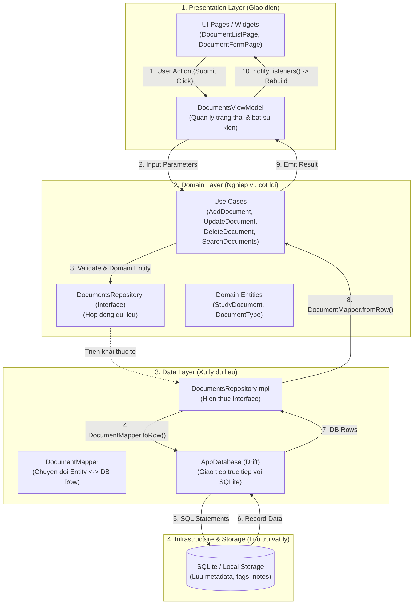
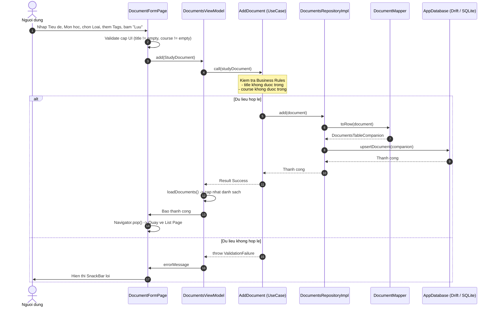
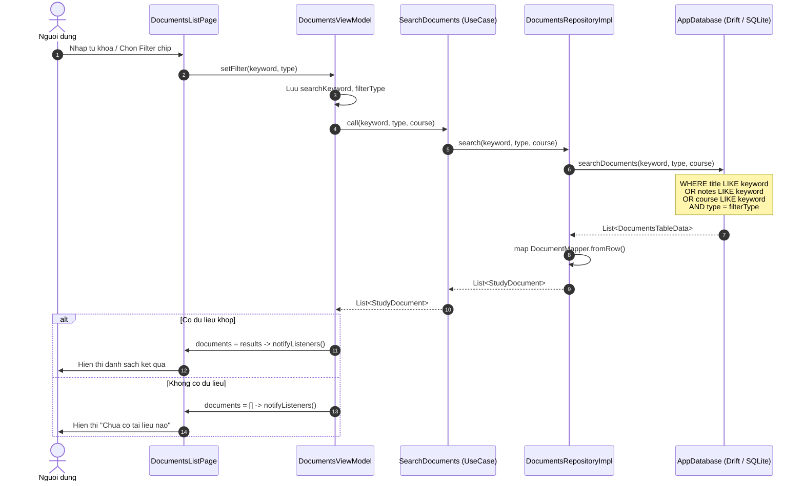
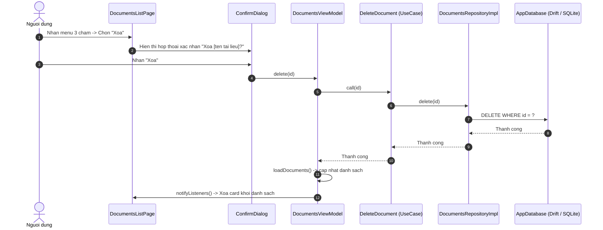

# Quan ly Tai lieu Hoc tap - Study Docs

Ung dung Flutter **Local-first**, **Modular** va **Layer-oriented** ho tro nguoi hoc to chuc, luu tru, tra cuu va tim kiem tai lieu hoc tap mot cach khoa hoc, hieu qua.

Kien truc du an duoc thiet ke theo nguyen tac **Feature-first** ket hop **Clean Architecture** (Presentation -> Domain -> Data), phan tach ranh gioi ro rang, de bao tri va san sang mo rong cac tinh nang nang cao.

---

## 1. Yeu cau chuc nang (Functional Requirements)

### 1.1. Phan he Quan ly Tai lieu (Core Documents Management)

Day la nghiep vu trung tam cua ung dung:

- **Them moi tai lieu (Create):**
  - Thong tin bat buoc: Tieu de (Title), Mon hoc (Course), Loai tai lieu (Document Type).
  - Thong tin mo rong: Danh sach nhan dan (Tags), Ghi chu (Notes).
  - Loai tai lieu ho tro: Bai giang (lecture), Bai tap (assignment), Tai lieu tham khao (reference), Khac (other).
- **Xem danh sach tai lieu (Read / List):**
  - Hien thi danh sach tai lieu dang Card kem thong tin truc quan.
  - Tu dong cap nhat sau moi thao tac Them, Sua, Xoa.
  - Sap xep theo thoi gian cap nhat gan nhat.
- **Chinh sua tai lieu (Update):**
  - Cap nhat tieu de, mo ta, mon hoc, loai tai lieu va danh sach tags.
  - Tu dong cap nhat moc thoi gian `updated_at`.
- **Xoa tai lieu (Delete):**
  - Hop thoai canh bao xac nhan truoc khi xoa.
  - Xoa vinh vien khoi co so du lieu.

### 1.2. Phan he Tim kiem & Loc (Search & Filtering)

- **Tim kiem theo tu khoa:** Khop tu khoa tren Tieu de, Ghi chu va Mon hoc.
- **Bo loc theo Loai tai lieu:** Loc nhanh bang chip filter (Tat ca / Bai giang / Bai tap / Tai lieu / Khac).
- **Tim kiem theo Mon hoc:** Loc tai lieu thuoc mon hoc cu the.

### 1.3. Phan he Gan nhan (Tags)

- Gan nhieu nhan dan (tags) cho moi tai lieu.
- Tim kiem va phan loai tai lieu qua tags.

---

### Bang ma tran chuc nang (Feature Matrix)

| Phan he | Phien ban hien tai | Dinh huong nang cao |
| :--- | :--- | :--- |
| **Documents** | Them, xem danh sach, sua, xoa | Xem truoc file, khoi phuc tu thung rac (soft delete) |
| **Categories** | Chon mon hoc cho tai lieu, loc theo mon | Quan ly cay danh muc phan cap da tang |
| **Tags** | Gan tags cho tai lieu, hien thi tag tren card | Goi y tag thong minh, quan ly mau sac tag |
| **Search** | Tim theo tu khoa + Loc theo Type/Course | SQLite FTS5, Semantic Search |
| **Storage** | Luu metadata vao SQLite local | Dinh kem file vat ly (PDF, Word, anh) |

---

## 2. Thiet ke So do Luong du lieu (Data Flow Diagrams)

### 2.1. So do kien truc luong du lieu tong quat (Layered DFD)



### 2.2. Luong nghiep vu Them moi tai lieu (Create Document Flow)



### 2.3. Luong Tim kiem & Loc (Search & Filter Flow)



### 2.4. Luong Xoa tai lieu (Delete Flow)



---

## 3. Cau truc thu muc va mo ta cac file

```text
study_docs/
├── lib/
│   ├── main.dart                          # Entry point, khoi tao DI thu cong
│   ├── core/
│   │   ├── error/
│   │   │   └── failures.dart              # Dinh nghia Failure, ValidationFailure, DatabaseFailure
│   │   └── utils/
│   │       └── uuid_generator.dart        # Sinh UUID v4 tu dong cho moi tai lieu
│   └── features/
│       └── documents/
│           ├── domain/                    # Tang nghiep vu - KHONG phu thuoc Flutter/Drift
│           │   ├── entities/
│           │   │   └── study_document.dart    # Entity chinh: StudyDocument, enum DocumentType
│           │   ├── repositories/
│           │   │   └── documents_repository.dart  # Interface: add, update, delete, search, getAll
│           │   └── usecases/
│           │       ├── add_document.dart      # Validate & goi repo.add()
│           │       ├── update_document.dart   # Validate & goi repo.update()
│           │       ├── delete_document.dart   # Goi repo.delete(id)
│           │       └── search_documents.dart  # Goi repo.search(keyword, type, course)
│           ├── data/                      # Tang du lieu - biet cach luu tru
│           │   ├── db/
│           │   │   └── app_database.dart      # Drift DB: DocumentsTable, cac query SQL
│           │   ├── mappers/
│           │   │   └── document_mapper.dart   # fromRow() va toRow() chuyen doi Entity <-> DB
│           │   └── repositories/
│           │       └── documents_repository_impl.dart  # Hien thuc DocumentsRepository
│           └── presentation/              # Tang giao dien - biet cach hien thi
│               ├── viewmodels/
│               │   └── documents_viewmodel.dart  # ChangeNotifier: quan ly state, goi use cases
│               └── pages/
│                   ├── documents_list_page.dart  # Man hinh chinh: danh sach, search, filter
│                   └── document_form_page.dart   # Man hinh them/sua tai lieu
└── test/
    └── features/documents/domain/
        └── add_document_test.dart         # Unit test: kiem tra business rules cua AddDocument
```

---

## 4. Mo ta cac lop va nguyen tac phan tach

### Tang Domain (`domain/`) - Trai tim cua he thong

- Khong import Flutter, Drift hay bat ky thu vien ngoai nao.
- Chi chua logic nghiep vu thuan tuy, co the test doc lap.
- `StudyDocument` la entity cot loi, khong phu thuoc DB schema.
- Moi UseCase chi co 1 nhiem vu duy nhat (Single Responsibility).

### Tang Data (`data/`) - Biet cach luu tru

- Phu thuoc vao Domain (implement interface).
- `AppDatabase` (Drift) quan ly SQLite, sinh code tu dong qua `build_runner`.
- `DocumentMapper` la cau noi duy nhat chuyen doi du lieu giua 2 the gioi.
- `DocumentsRepositoryImpl` khong chua business logic.

### Tang Presentation (`presentation/`) - Biet cach hien thi

- Phu thuoc vao Domain (goi use cases), khong biet Data tang ton tai.
- `DocumentsViewModel` la trung gian giua UI va Domain.
- Pages/Widgets chi quan tam den hien thi va bat su kien nguoi dung.

---

## 5. Nguyen ly phu thuoc (Dependency Rule)

```text
Presentation --> Domain <-- Data
```

- Presentation phu thuoc Domain (goi UseCase, biet Entity).
- Data phu thuoc Domain (implement Repository interface).
- Domain khong phu thuoc ai ca.
- **Ket qua:** Co the thay SQLite bang Firebase, thay Provider bang BLoC ma khong can sua Domain.

---

## 6. Huong dan cai dat va chay ung dung

### Yeu cau moi truong

- Flutter SDK 3.47 tro len.
- Dart SDK 3.13 tro len.

### Cai dat dependencies

```bash
flutter pub get
```

### Sinh code Drift (bat buoc lan dau)

```bash
dart run build_runner build
```

### Chay ung dung

```bash
# Chay tren Linux desktop
flutter run -d linux

# Chay tren Chrome
flutter run -d chrome

# Chay tren thiet bi di dong / may ao
flutter run
```

### Kiem tra chat luong ma nguon & Kiem thu

```bash
flutter analyze
flutter test
```

---

## 7. Cong nghe su dung

| Thanh phan | Cong nghe | Ly do chon |
| :--- | :--- | :--- |
| UI Framework | Flutter 3.47 | Da nen tang, hieu nang cao |
| State Management | Provider + ChangeNotifier | Don gian, du manh cho quy mo nay |
| Local Database | Drift (SQLite) | Type-safe, code gen, giong Cashew goc |
| ID Generation | uuid v4 | Chuan cong nghiep, khong trung lap |
| Date Formatting | intl | Dinh dang ngay gio theo Locale |
| Testing | mockito + flutter_test | Mock repository de test Domain doc lap |

---

## 8. Ket qua kiem thu

```text
flutter test

00:01 +3: All tests passed!

Tests:
  - AddDocument: Goi repository.add khi du lieu hop le     PASSED
  - AddDocument: Throw ValidationFailure khi title rong    PASSED
  - AddDocument: Throw ValidationFailure khi course rong   PASSED
```

---

Du an duoc thuc hien boi Phung Thanh An - Ap dung kien truc Cashew vao bai toan Quan ly Tai lieu Hoc tap.